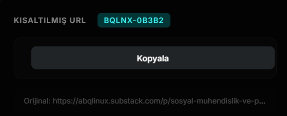
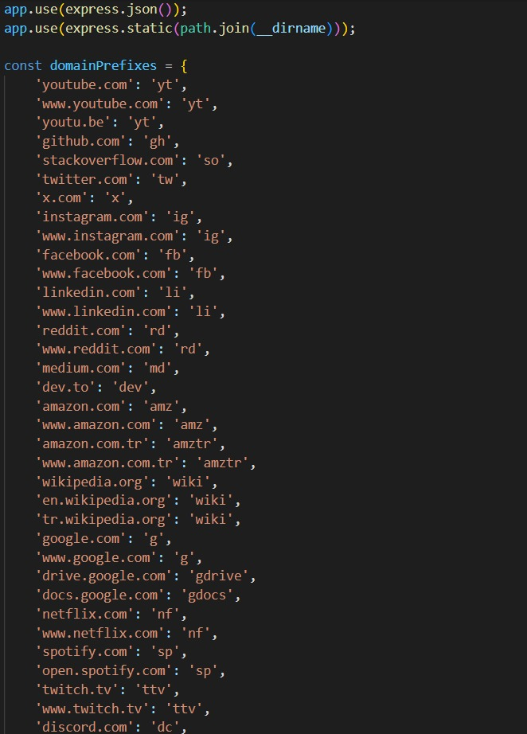
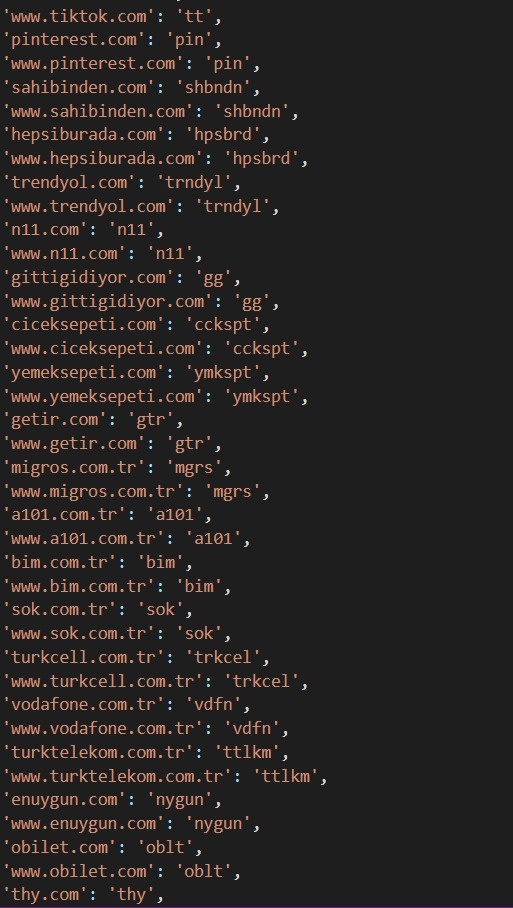
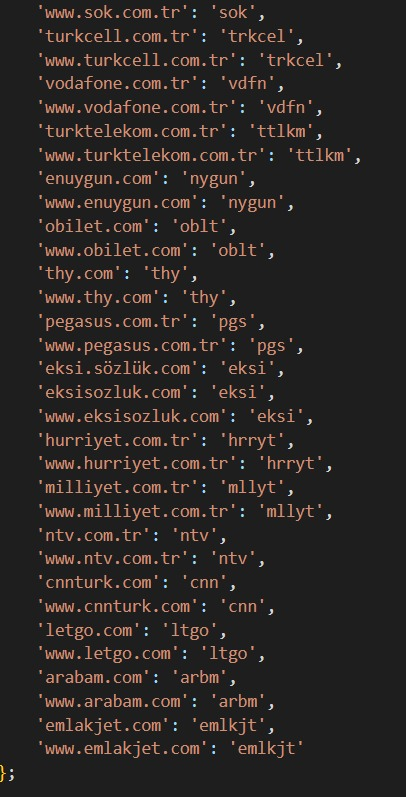

# Kaydettiğiniz uzun adresleri tek tıkla kısaltın ve daha kompakt bir görünüm sağlayın.


<p align="left">
    <a href="https://www.instagram.com/umutyalcine?igsh=c21xZ2psNG56cHN5" target="_blank"></a><a href="https://www.instagram.com/1yildapentesterolcam?igsh=MTU0dmRwbDNwMXlvcw==" target="_blank"></a><a href="https://open.substack.com/pub/abqlinux?utm_source=share&utm_medium=android&r=6dmoxh" target="_blank"></a><a href="https://1000kitap.com/Meineliebewittgenstein" target="_blank"></a>
</p>

---

## Eklenti ile alakalı ekran görüntüleri / Screenshots related to the extension

<p align="center">
  
  
  
  
  
  
  
  
</p>

---


# 🔗 URL Kısaltıcı

Basit, şık ve kullanımı kolay bir URL kısaltıcı uygulaması.


## ✨ Özellikler

- 🎨 Modern ve şık arayüz (glassmorphism tasarım)
- 🔗 Site adına göre akıllı kısa kod üretimi
- 📊 Tıklama sayacı
- 📋 Tek tıkla kopyalama
- 📱 Mobil uyumlu tasarım

# 🔗 URL Shortener
A simple, elegant and easy-to-use URL shortener application.

✨ Features
🎨 Modern and sleek interface (glassmorphism design)

🔗 Smart short code generation based on site name

📊 Click counter

📋 One-click copy

📱 Mobile responsive design

## 🚀 Kurulum

```bash
# Bağımlılıkları yükle
npm install

# Sunucuyu başlat
npm start
```

Tarayıcıda [http://localhost:3000](http://localhost:3000) adresini açın.

## 📝 Kullanım

1. URL giriş alanına kısaltmak istediğiniz URL'yi yapıştırın
2. "Kısalt" butonuna tıklayın
3. Oluşturulan kısa URL'yi kopyalayın ve paylaşın

## 🔤 Kısa Kod Örnekleri

| Orijinal Site | Kısa Kod Formatı |
|---------------|------------------|
| youtube.com   | `yt-xxxxx`       |
| github.com    | `gh-xxxxx`       |
| instagram.com | `ig-xxxxx`       |
| twitter.com   | `tw-xxxxx`       |
| reddit.com    | `rd-xxxxx`       |

## 📁 Proje Yapısı

```
url-shortener/
├── index.html      # Arayüz
├── server.js       # Express sunucusu
├── package.json    # Proje yapılandırması
├── .gitignore      # Git hariç tutma
└── README.md       # Bu dosya
```

## ⚠️ Notlar

- URL'ler bellekte tutulur, sunucu yeniden başlatıldığında silinir
- Sadece yerel kullanım içindir (localhost)


## 💻 Proje Teknolojileri: / Project Technologies:

<p align="left">
    <a href="https://developer.mozilla.org/en-US/docs/Web/JavaScript" target="_blank" rel="noreferrer"></a><a href="https://www.w3.org/html/" target="_blank" rel="noreferrer"></a><a href="https://www.w3schools.com/css/" target="_blank" rel="noreferrer"></a><a href="https://desktop.github.com/" target="_blank" rel="noreferrer"></a>
</p>

## 📄 Lisans

MIT License


